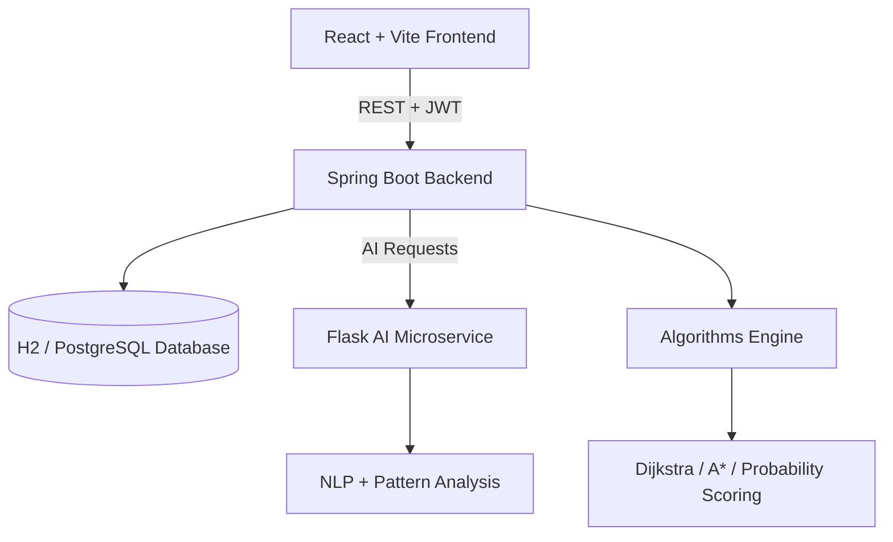

<div align="center">

# 🕵️ Digital Crime Scene Reconstruction System

### AI-powered forensic investigation and case reconstruction platform

<p>
  <a href="https://digital-crime-scene-p3b8xsd65-gokul45.vercel.app"><strong>🌐 Live Demo</strong></a> ·
  <a href="https://github.com/Gokul-45/digital-crime-scene"><strong>📦 Source Code</strong></a>
</p>


</div>

---

## ✨ Project Overview

**Digital Crime Scene Reconstruction System** is a full-stack investigation platform that helps investigators organize cases, manage evidence, analyze witness statements, reconstruct incident timelines, and generate AI-assisted insights through a modern web interface.

> **Important:** This is an educational and prototype investigation-support system. AI outputs are assistive and must not be treated as verified forensic conclusions.

## 🌐 Live Application

| Service | Link |
|---|---|
| **Frontend / Live Demo** | [Open Digital Crime Scene](https://digital-crime-scene-p3b8xsd65-gokul45.vercel.app) |
| **Spring Boot API** | [Backend API](https://digital-crime-scene.onrender.com) |
| **AI Microservice** | [AI Service](https://digital-crime-ai-prod.onrender.com) |

Click the **Live Demo** link above to open the deployed application in your browser.

## 🎯 Core Modules

- 📊 **Investigation Dashboard** — case statistics, charts and priority overview
- 🗂️ **Case Management** — create, update, filter, change status and delete cases
- 🧪 **Evidence Repository** — physical/digital evidence and chain-of-custody tracking
- 👁️ **Witness Management** — witness profiles and statement analysis
- 🧍 **Suspect Analysis** — probability scoring and behavioral correlation
- 🗺️ **Path Prediction** — Dijkstra and A* algorithms over location graphs
- 🕒 **Timeline Reconstruction** — Before / During / After incident events
- 🤖 **AI Insights** — anomaly and inconsistency detection assistance
- 📄 **PDF Reports** — export investigation summaries
- 🔐 **Authentication** — JWT-based login and role-aware access

## 🖥️ Interface Showcase

The live interface contains the following major screens. Open the [Live Demo](https://digital-crime-scene-p3b8xsd65-gokul45.vercel.app) to explore them interactively.

| Dashboard | Case Management |
|---|---|
| 📊 Overview of active investigations, statistics and charts | 🗂️ Create, search, filter, update and delete cases |

| Evidence | AI Insights |
|---|---|
| 🧪 Evidence records and custody information | 🤖 AI-assisted anomaly and inconsistency insights |

> **Screenshot note:** The repository documents the actual application through the live deployment link. Add browser screenshots to this section later if you want a visual gallery of the running UI.

## 🧩 System Architecture



## 🛠️ Technology Stack

| Layer | Technologies |
|---|---|
| Frontend | React, Vite, Tailwind CSS, Recharts, Leaflet |
| Backend | Java, Spring Boot, Spring Security, JWT, JPA/Hibernate |
| Database | H2 in-memory for demo; PostgreSQL-ready architecture |
| AI Service | Python, Flask, pattern-based NLP fallback |
| Deployment | Vercel, Render and GitHub |

## 🚀 Run Locally

### Backend

```bash
cd backend
mvn spring-boot:run
```

### AI Microservice

```bash
cd ai-service
pip install -r requirements.txt
python app.py
```

### Frontend

```bash
cd frontend
npm install
npm run dev
```

## 🔐 Demo Credentials

| Role | Username | Password |
|---|---|---|
| Admin / Commander | `admin` | `password123` |
| Lead Investigator | `det_sharma` | `password123` |
| Forensic Analyst | `analyst_ak` | `password123` |

## 📚 Documentation

- [Algorithms Overview](docs/ALGORITHMS.md)
- [Deployment Guide](docs/DEPLOYMENT.md)

## 🔮 Future Enhancements

- Persistent production PostgreSQL database
- Advanced NLP and entity extraction
- Evidence file uploads with secure storage
- Role-specific permissions and audit logs
- More detailed analytics and investigation workflows

---

<div align="center">

### Built with Java, React, Python and curiosity 🔍

**[🚀 Visit the Live Project](https://digital-crime-scene-p3b8xsd65-gokul45.vercel.app)**

</div>
